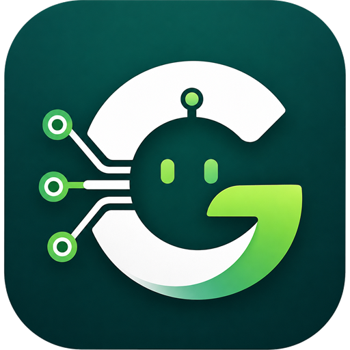
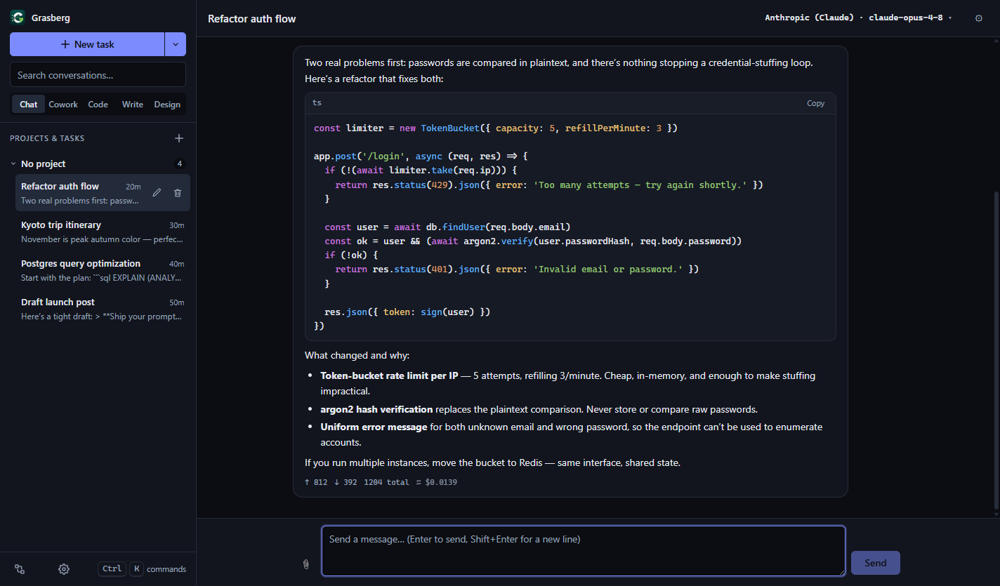
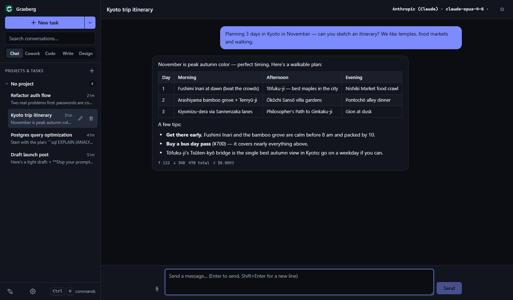
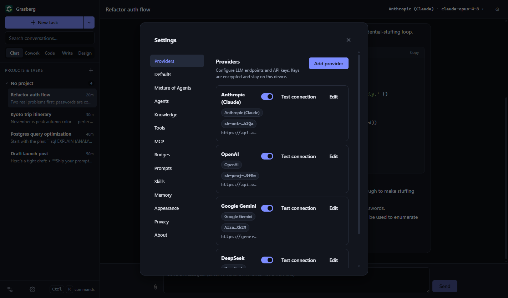
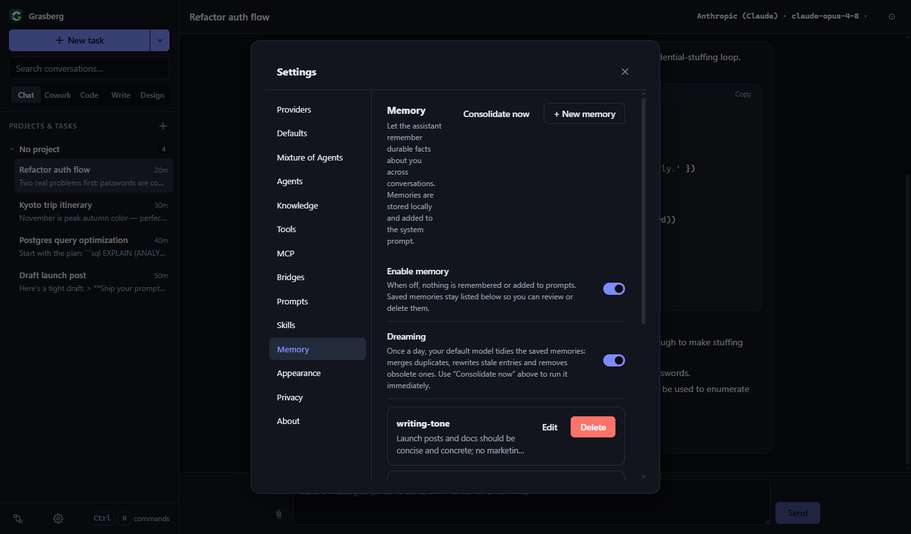

<div align="center">



# Grasberg

**Every AI model. One private desktop app.**

A local-first desktop client for OpenAI, Anthropic, Google Gemini, Amazon Bedrock, DeepSeek, GLM/Zhipu, MiniMax — and **120+ OpenAI-compatible providers** — behind one polished interface. Your keys are encrypted on your machine. Your conversations never leave it.

[](LICENSE)
[](tsconfig.json)
[](package.json)
[](package.json)
[](#building-installers)

**[grasberg.com](https://grasberg.com/)** · [Features](#features) · [Screenshots](#screenshots) · [Getting started](#getting-started) · [Provider setup](#provider-setup) · [Security](#security--privacy) · [Docs](docs/ARCHITECTURE.md)



</div>

---

## Why Grasberg?

- 🔐 **Local-first & private** — history in a local SQLite database, API keys encrypted with your OS key store (DPAPI / Keychain / libsecret). No account, no cloud sync, no telemetry.
- 🧩 **Every provider, one app** — native adapters for OpenAI, Anthropic, Gemini and Bedrock; battle-tested OpenAI-compatible base for DeepSeek, GLM/Zhipu, MiniMax, Z.ai — plus **120+ one-click presets** (OpenRouter, Groq, xAI, Mistral, Together, Ollama, LM Studio, …) generated from the [models.dev](https://models.dev) catalog.
- 🛠️ **A real agent loop** — streaming tool calls with per-tool permissions: built-in tools, custom HTTP tools, **MCP servers** (stdio + HTTP), sub-agents, an opt-in sandboxed browser, and an opt-in approval-gated shell.
- 🖥️ **Five modes, one window** — Chat, Cowork, Code, Write and Design, each shaped for a different kind of work.

## Features

### Models & providers

- **Native adapters** for the Anthropic Messages API (with **prompt caching**), Google Gemini, and Amazon Bedrock's Converse API (bearer token — no AWS SDK), plus a hardened OpenAI-compatible adapter that powers everything else.
- **Sign in with ChatGPT** (experimental OAuth) — run OpenAI models on your ChatGPT subscription instead of a platform key. Subscription/coding-plan keys for **Z.ai (GLM)** and **MiniMax** hit the right endpoints out of the box.
- **Model catalog + live listing** — capability badges (tools · vision · reasoning · context length), live `/models` where supported, catalog fallback where not.
- **Per-conversation overrides** for provider, model, system prompt and sampling parameters — plus optional per-mode defaults.

### Chat experience

- **Token-by-token streaming** with stop, regenerate, and edit-and-rerun. Reasoning/thinking output is shown separately for models that emit it.
- **Rich rendering** — GitHub-flavored Markdown, syntax-highlighted code, **KaTeX math** and **Mermaid diagrams**.
- **Vision input** — attach images to vision-capable models; text files are inlined as context.
- **Cost & usage** — per-message token counts with an approximate cost estimate.
- **Context compaction** — `/compact` on demand, or automatic summarization when a conversation approaches the model's context window.
- **Command palette, prompt library, conversation search, projects & tasks** to keep long-running work organized, and a **tray icon + global shortcut** (`Ctrl/Cmd+Shift+G`) to summon the window.

### Multi-model workflows

- **Mixture of Agents** — define presets where several *advisor* models answer in parallel and an *aggregator* model synthesizes the final reply (with the full tool loop intact). Trigger per conversation or one-shot with `/moa`.
- **Arena compare** — run the same prompt across models side by side and pick the winner.
- **Agent profiles** — named personas with their own system prompt, model and restricted toolset, usable by the `delegate` sub-agent and workflow nodes.
- **Automatic model routing** — an optional provider-neutral Auto policy can prefer lowest cost, highest quality, or localhost-only models when a task has no explicit target.

### Tools, MCP & agents

- **Built-in tools** — `web_search`, `fetch_url`, file search, `grep`/`glob`, `git`, a BM25 **`repo_map`** code locator, read/list/edit/write files (through an audited change pipeline), and a **`delegate` sub-agent** that can also run as a background task.
- **MCP** — connect real [Model Context Protocol](https://modelcontextprotocol.io) servers over stdio or HTTP and manage them from Settings.
- **Custom HTTP tools** — define your own JSON tools against any API, with encrypted secret headers.
- **Opt-in shell execution** — off by default; when enabled, every command is approval-gated with a configurable allowlist. Otherwise shell commands are only ever *suggested*, never run.
- **Browser & computer use** — an opt-in, embedded, **sandboxed** browser the assistant can drive (navigate, read, click, type, screenshot). Isolated from your OS; vision models receive screenshots after each action.
- **One permission model** for all of it — per-tool allow/ask/deny, with approval dialogs scoped to a call or a conversation.

### Memory, skills & knowledge

- **Persistent memory** — the assistant saves durable facts across conversations (reviewable and editable in Settings), injected into the system prompt.
- **Dreaming** — once a day, your default model automatically *consolidates* memory: merges duplicates, rewrites stale entries, deletes obsolete ones. On by default, one-click off, or run manually with **Consolidate now**.
- **Skills** — a bundled skill library ships with the app; import your own skill folders (SKILL.md format) and the model loads them on demand via `use_skill`.
- **Knowledge bases (RAG)** — import files into a knowledge base; they are chunked, embedded and searchable by the assistant through a retrieval tool.

### Automation

- **Visual workflow builder** — wire nodes (input, template, AI agent, HTTP request, output) on a React Flow canvas; runs in-process with run history.
- **Scheduler** — run any saved workflow on an interval.
- **Telegram bridge** — bind a bot to a conversation and chat with your assistant from your phone (trust-on-first-use pairing, single authorized chat).
- **Outbound webhook** — POST every completed reply to your own endpoint (opt-in).
- **Agent control plane** — background delegates have persistent run history and can be stopped from Settings; Work tasks can be forked into isolated Git worktrees.
- **Checkpoints & forks** — every applied assistant change captures a persistent pre-edit checkpoint, and conversations can branch without losing their original history.
- **Project hooks & agent packs** — allowlisted lifecycle quality gates plus portable JSON bundles of agents, skills, and hooks.
- **IDE bridge** — open the current task or isolated worktree in VS Code, Cursor, or Zed from Work mode.

### Everything a daily driver needs

- Light / dark / system theme, adjustable font size, onboarding wizard.
- Export conversations to **Markdown or JSON**; Write-mode documents export to **Markdown or HTML**.
- **Backup & restore** — one file with settings, memories and skills. Secrets are never exported, and security-sensitive settings are never applied from an imported file.

## Screenshots

| | | |
|---|---|---|
|  |  |  |
| Full GitHub-flavored Markdown | Every provider in one place, keys shown only masked | Persistent memory with Dreaming |

## The five modes

| Mode | What it's for |
|---|---|
| **Chat** | Fast streaming conversations — switch models mid-thread, see reasoning separately, attach images. |
| **Cowork** | Goal-oriented workspaces with notes, plans, checklists, tasks and docs kept alongside the conversation, plus progress summaries. |
| **Code** | Open a local folder (explicit permission required), browse the tree, ask questions, and review proposed changes as **diffs that apply only when you click**. A staleness guard prevents applying diffs over files that changed since. |
| **Write** | A Markdown document lives next to the chat — editable, assistant-augmented, exportable to Markdown/HTML. |
| **Design** | Interactive HTML prototypes rendered live in a fully sandboxed preview (no network, no OS access). |

## Getting started

Prerequisites: **Node.js 20+** and **npm**.

```bash
npm install
npm run dev
```

| Script | What it does |
|---|---|
| `npm run dev` | Start in development mode (electron-vite, hot reload) |
| `npm run build` | Typecheck both tsconfig projects, then build main/preload/renderer to `out/` |
| `npm run typecheck` | `tsc --noEmit` against `tsconfig.node.json` and `tsconfig.web.json` |
| `npm test` | Run the Vitest suite once (`npm run test:watch` for watch mode) |
| `npm run package:win` / `package:mac` / `package:linux` | Build + package installers into `release/` |

## Building installers

Packaging is configured in [`electron-builder.yml`](electron-builder.yml); artifacts land in `release/`.

- **Windows:** NSIS installer (per-user, choosable install location)
- **macOS:** DMG + ZIP
- **Linux:** AppImage + deb

> Cross-OS packaging is not supported — build each OS's installer on that OS (or use a CI matrix). **Code signing is intentionally unconfigured**; add your own certificate/notarization config before public distribution.

## Provider setup

Add a provider in **Settings → Providers**, pick a type, and paste an API key. Keys are encrypted immediately; only a masked preview (like `sk-…4f2a`) is ever shown again.

| Provider | Where to get a key | Default base URL |
|---|---|---|
| OpenAI | <https://platform.openai.com/api-keys> | `https://api.openai.com/v1` |
| Anthropic (Claude) | <https://console.anthropic.com/settings/keys> | `https://api.anthropic.com/v1` |
| Google Gemini | <https://aistudio.google.com/apikey> | `https://generativelanguage.googleapis.com/v1beta` |
| Amazon Bedrock | AWS console (bearer token) | `https://bedrock-runtime.{region}.amazonaws.com` |
| DeepSeek | <https://platform.deepseek.com> | `https://api.deepseek.com/v1` |
| GLM / Zhipu AI | <https://open.bigmodel.cn> | `https://open.bigmodel.cn/api/paas/v4` |
| MiniMax | <https://platform.minimax.io> | `https://api.minimax.io/v1` |
| Z.ai GLM Coding Plan | <https://z.ai> (subscription) | `https://api.z.ai/api/coding/paas/v4` |
| 120+ OpenAI-compatible presets | pick from the **Add provider** list | pre-filled per preset |
| OpenAI-compatible (custom) | your server / vendor | — (you provide it) |

<details>
<summary><b>Provider notes</b> (presets, ChatGPT sign-in, Bedrock, local servers…)</summary>

- **OpenAI-compatible presets:** the Add-provider picker lists 120+ providers (from models.dev). Choosing one pre-fills the base URL and model catalog — just paste the key. Regenerate the catalog with `scripts/generate-presets.ts`.
- **Sign in with ChatGPT (experimental):** choose the OpenAI provider type and set Authentication to *Sign in with ChatGPT*. Requests are billed to your ChatGPT subscription via the ChatGPT backend. It is **reverse-engineered and unofficial** — it can stop working without notice. Tokens are encrypted on-device. If it breaks, use an OpenAI API key instead.
- **Amazon Bedrock:** uses a **bearer token** (`AWS_BEARER_TOKEN_BEDROCK`) via the Converse API — no SigV4/AWS SDK. Set your region in the base-URL host. Streaming is non-incremental (one Converse response per turn).
- **Z.ai Coding Plan:** targets the coding-only endpoint (`/api/coding/paas/v4`), which is **not** interchangeable with the general `/api/paas/v4` endpoint.
- **MiniMax subscription:** the same API key as pay-as-you-go. (China mainland: use `api.minimaxi.com` via a custom OpenAI-compatible provider.)
- **Local & self-hosted:** Ollama, vLLM, LM Studio, or any OpenAI-compatible server — point the custom type at its `/v1` base URL. Plain `http://` is allowed for localhost only.

</details>

## Security & privacy

- **Keys never leave the main process.** They're encrypted at rest with Electron [`safeStorage`](https://www.electronjs.org/docs/latest/api/safe-storage) (Windows DPAPI, macOS Keychain, Linux libsecret), stored only as ciphertext in SQLite, never sent to the renderer, and never logged — error messages pass through a redaction step first. If OS encryption is unavailable at first launch (e.g. a locked Linux keyring), keys are held in a clearly-marked reversible fallback and re-encrypted automatically once the key store is available.
- **HTTPS-only providers** — plain `http://` is allowed only for localhost, so a bearer key is never sent in cleartext to a remote host.
- **Sandboxed renderer** — `contextIsolation: true`, `sandbox: true`, no Node integration; the UI talks to the main process only through a typed, zod-validated IPC surface.
- **Safe by default** — shell execution, browser/computer tools and the Telegram bridge are all opt-in, and dangerous operations are approval-gated per call. Code mode never writes to disk without an explicit click.
- **No telemetry, no analytics, no phone-home.** The only network traffic is to the providers you configure. Everything is stored locally:
  - Windows: `%APPDATA%\Grasberg` · macOS: `~/Library/Application Support/Grasberg` · Linux: `~/.config/Grasberg`

## Architecture

TypeScript end-to-end across three electron-vite targets — **main** (Node), **preload** (contextBridge), **renderer** (sandboxed React 19 + Zustand). SQLite via `node-sqlite3-wasm` (real SQLite, zero native compilation — the test suite runs in plain Node on any OS).

<details>
<summary><b>Project structure</b></summary>

```
src/
  shared/      types.ts ipc.ts schemas.ts catalog.ts   ← the contract (no runtime deps)
  main/        Electron main process
    db/          SQLite (node-sqlite3-wasm), migrations, repositories
    providers/   ProviderAdapter interface + per-provider adapters + registry
    keys/        safeStorage-backed keystore
    services/    chat orchestration, MoA, memory + dreaming, compaction, backup
    code/        Code-mode project access, file tree, diff apply gate
    tools/       tool registry, executor, permissions, MCP manager
    browser/     embedded sandboxed browser session
    workflows/   workflow engine, runner, scheduler
    im/          Telegram bridge + outbound webhook
    ipc/         zod-validated IPC handlers
  preload/     contextBridge implementation of window.uld
  renderer/    React 19 + Zustand UI
tests/         Vitest unit + integration tests (real temp SQLite, mocked fetch)
docs/          ARCHITECTURE.md · DB_SCHEMA.md · ADDING_A_PROVIDER.md
```

</details>

See [docs/ARCHITECTURE.md](docs/ARCHITECTURE.md) for the process model and streaming pipeline, and [docs/DB_SCHEMA.md](docs/DB_SCHEMA.md) for the database schema.

## Testing

```bash
npm test
```

400+ tests cover the provider adapters (mocked `fetch`: SSE parsing, error normalization, retries, proof that keys never appear in errors), database repositories and migrations, diff/change-block parsers, path-traversal and symlink-escape guards, the tool registry/executor/approval broker, memory consolidation, and the multi-round tool-call loop — all against real temp SQLite databases, no Electron required.

## Contributing

The most common contribution is a new provider adapter — [docs/ADDING_A_PROVIDER.md](docs/ADDING_A_PROVIDER.md) is a step-by-step walkthrough with a PR checklist (streaming, abort, error normalization, redaction, mocked-fetch tests). Bug reports and PRs welcome.

## License

[MIT](LICENSE) © 2026 Grasberg contributors.
